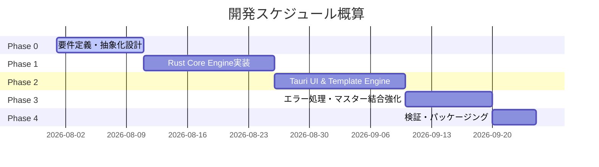

# 全体実装計画・製品設計書 (implementation_plan.md)

## 1. プロダクト概要とゴール

### コンセプト
**「BIツールやAIは不要。売上伝票やログCSVを入れるだけで、明日のアクション（営業のカンペ・改善指示）がガシャンと出る自動販売機」**

分析結果のグラフを見るだけでは動けない現場に向け、データサイエンティストやアナリストの思考プロセスをシステム化し、「具体的な答え」を直接現場に提供する入門用デスクトップツール。

---

## 2. ターゲットと解決する課題

- **ターゲット:** 専任のデータ分析担当者がいない中堅・中小企業（製造業、卸売業、物流業等）。
- **解決する課題:**
  1. **「データはあるが、戦略がない・見方がわからない」** ➔ グラフではなく「答え（行動指示）」だけを出すUIで解決。
  2. **「営業や現場が外部へのデータ持ち出し・クラウド化を嫌がる」** ➔ インターネット非接続の完全オフライン動作 ＆ ローカル処理で解決。
  3. **「既存BIやExcelツールが使いこなせない・重い」** ➔ Rust + Tauriのシングルバイナリで爆速・環境構築ゼロで解決。

---

## 3. ビジネスモデル（KSPとしての戦略）

単体での大儲けを狙うのではなく、本業（SI案件・外付け情シスコンサル）へ誘導するための「撒き餌（ドアノック）」として活用する。

- **STEP 1: デモ版提供（無料・ドアノック）**
  - 「上位3件の分析結果」のみが出る機能制限版をUSBで手渡し、「自社データからこんな答えが出るのか」という成功体験と渇望を与える。
- **STEP 2: カスタマイズ課金（スポット収益: 数十万円）**
  - 「顧客属性を掛け合わせたい」「特定条件でフィルタリングしたい」等の要望に応じ、企業別独自仕様へカスタマイズ販売。
- **STEP 3: システム連携・自動化（本命SI案件への引きずり込み）**
  - 「毎月手作業でCSVを吐き出して読み込ませるのが面倒」というペインが生じたタイミングで、基幹システム連携自動化ソリューションやデータコンサルを提案。

---

## 4. アーキテクチャ ＆ 多用途（プリセット）設計

### コア設計: 抽象化共起分析エンジン
入力データを `(GroupID, ItemID)` の2軸概念に抽象化することで、全く同じRust集計エンジンで複数の用途に対応する。

```
[入力CSV] 
   │ 
   ├── ユーザーが選択した「プリセット（用途）」と「列マッピング」
   ▼
[Rust Core Engine]
   │  └─ 共通: 高速共起分析（Support / Confidence / Lift 値算出）
   ▼
[Tauri / Web UI]
   └─ プリセット別カンペ生成テンプレート（自然言語化）
```

### アドオン（プラグイン）拡張アーキテクチャ
顧客別のカスタマイズ要望（RFM分析、クラスタリング、需要予測など）に迅速に応えるため、アプリ本体のリビルドを必要としない**アドオン拡張構造**を採用する。
- **実装方式:** 指定ディレクトリ（`plugins/`）にWASMファイル（または外部実行バイナリ）を配置するだけで、Tauriアプリ起動時に動的にロード・認識する。
- **I/Oインターフェース:** 本体からプラグインへは「標準化されたJSON/CSV」、プラグインから本体へは「出力用カンペJSON」を渡す仕様とし、フロントエンド側で動的にメニューを追加する。

### 4つのプリセット詳細

| プリセット名 | GroupID（箱） | ItemID（モノ） | 出力される「カンペ」例・営業的価値 |
| :--- | :--- | :--- | :--- |
| **① 売上・ついで買い提案** | 伝票番号 / 顧客ID | 商品コード | 「〇〇を買った顧客の80%が〇〇も購入しています。明日の商談でセット提案してください。」 |
| **② 倉庫ピッキング動線** | 出荷指示書ID | 商品コード | 「商品Aと商品Bは80%の確率で同時出荷されます。棚を隣同士に再配置して歩行距離を短縮してください。」 |
| **③ 不良・機械トラブル解析** | エラー発生イベントID | ラインID / ロット番号 / 作業条件 | 「第2ラインでロットXを使用時、エラーAが90%発生。明日以降のロットXの使用を避けてください。」 |
| **④ システム隠れた使い方** | セッションID | 画面ID / 機能ID | 「画面Aを開く人は必ず機能Bをセットで使用。1クリックで遷移できるボタンを作成してください。」 |

---

## 5. 懸念点と対応方針

> [!IMPORTANT]
> **懸念①: CSV表記揺れ・フォーマット乱れ**
> - **対策:** CSV読み込み時に文字コード（Shift-JIS/UTF-8）を自動判別し、日付形式や数値のカンマを自動除去。列マッピングUIを最初のステップとして用意。

> [!WARNING]
> **懸念②: 匿名コード表示による視認性の低さ**
> - **対策:** ローカル内で閉じた「マスターCSV（顧客名・商品名）」の任意結合機能を設け、外部に出さずに名寄せ表示を可能にする。

> [!NOTE]
> **懸念③: Windows SmartScreen警告・セキュリティブロック**
> - **対策:** 配布バイナリに対するコード署名、または正規インストーラー化を行い、導入時の警戒感を排除。

## [Phase 2] フロントエンドUI & カンペ生成 実装計画 (Next Step)

バックエンド（Rust）からのデータ取得に成功したため、次にこれを「現場のカンペ」に変換する UI/UX の実装を行います。

### 1. 画面レイアウト（ワイヤーフレーム構想）
モダンでリッチなダークテーマ（Glassmorphismなど）を基調とします。
- **左ペイン（入力・設定）:** 
  - プリセット選択プルダウン（売上 / 倉庫 / 品質 / IT）
  - CSVファイルドラッグ＆ドロップエリア
  - サンプルデータで試す（Demo）ボタン
- **右ペイン（カンペビューア）:**
  - Rustから返却されたJSONを、見やすい「アクションカード」として一覧表示。
  - 数値（%）に応じて色分け（例: 80%以上は赤色/強調表示）し、直感的に優先度がわかるようにします。

### 2. カンペ文言生成テンプレートエンジン（TypeScript側）
生のJSON（`item_a`, `item_b`, `confidence`）を受け取り、選択されたプリセットに応じた自然言語に変換するロジックを実装します。

- **売上分析（デフォルト）の場合:** 
  `「${item_a} を買ったお客様は、${confidence * 100}% の確率で ${item_b} も買っています。レジ横で一緒にお勧めしてください！」`
- **倉庫ピッキングの場合:** 
  `「${item_a} と ${item_b} は同時に出荷される確率が ${confidence * 100}% です。ピッキング動線を短縮するため、隣接した棚に配置してください。」`

### 3. スタイリング (Vanilla CSS)
- `TailwindCSS` は使わず、`Vanilla CSS` (CSS変数) で構築し、アニメーション（ホバー時のカード浮き上がり、フェードイン）を取り入れて「WOW」を生むプレミアムなデザインを実現します。

## [Phase 2.5] 「だから？」を解消するUI/UX改善計画 (Next Step)

現在のUI（IDと確率の羅列）では、現場のスタッフが「結局どう動けばいいのか？」を直感的に理解しにくい（「だから？」と言われてしまう）という課題があります。
これを解決するため、**「専門用語の排除」「行動の具体化」「商品名の表示」**を行います。

### 1. マスターデータのモック導入 (Phase 3の簡易前倒し)
現場が直感的に理解できるよう、`P001`, `P002` といった無機質なIDではなく、**具体的な商品名**を表示します。
- 今回のプロトタイプでは、フロントエンド（TypeScript）側にダミーの商品マスター（例: `P001` = `プレミアム化粧水`, `P002` = `保湿美容液`）を定義し、IDを商品名に置換して表示します。

### 2. 「アクション（行動）」と「根拠（データ）」の分離
カンペカードの構成を以下のように変更し、**一番大きく「行動指示」を表示**します。

**【改善後のカンペカード（例）】**
- **🎯 明日のアクション:** 
  `『プレミアム化粧水』をお買い上げのお客様には、必ず『保湿美容液』をご提案してください。`
- **💡 なぜ？ (根拠):** 
  `過去のデータ上、化粧水を買ったお客様の【100%】が美容液もセットで購入しているため、非常に刺さりやすい提案です。`
- *(小さく表示)* `共起回数: 4回 / リフト値: 1.2`

### 3. 文言テンプレートのアップデート
「確率が80%」といった分析者目線の言葉を減らし、現場のセールスマンがそのまま商談や接客で使える言葉遣いにチューニングします。

> [!IMPORTANT]
> **User Review Required**
> 専門用語を隠し、「具体的な商品名」と「明確なアクション」を強調する上記のレイアウト変更で進めてよろしいでしょうか？
> 問題なければ、TypeScript側のテンプレートとCSSを書き換えて、現場目線のUIへブラッシュアップします。
## [Phase 3] 実用化に向けた追加実装プラン (Next Step)

プロトタイプ（Phase 2）の完成を受け、より実業務に耐えうるシステムへと進化させるための実装案です。以下のどの機能から優先して実装を進めるかご検討ください。

### Phase 3 実装スケジュール：案A ➔ 案C の順で進行

#### 1. 案A: CSVドラッグ＆ドロップ ＋ マスターデータ連携 (仕様詳細)
- **UI拡張 (TypeScript/HTML):** 
  - 現在のドロップエリアを拡張し、TauriのAPI (`@tauri-apps/plugin-dialog` または HTML5 File API) を用いて、任意のファイルの絶対パスまたは中身を取得できるようにします。
  - 「分析対象のCSV」と「商品マスターCSV」の2つをセットできるUIに変更します。
- **マスター結合機能 (Rust):**
  - マスターCSVは `item_id, item_name` の形式を想定します。
  - Rust側の `analyze_csv` コマンドの引数を変更し、`master_path: Option<String>` を受け取れるようにします。
  - マスターパスが渡された場合、Rust側で事前にマスターをHashMapとして読み込み、分析結果の `Rule` を生成する際にIDを「商品名」に自動で差し替えてフロントへ返却します。

#### 3. 案B: アドオン（プラグイン）構想のアーキテクチャ設計 (Next!)
SIerが顧客ごとに独自の分析ロジック（RFM分析、在庫予測など）を容易に追加でき、かつ本体の再ビルドを不要にするための仕組みです。

- **採用方式: CLI（外部プロセス）呼び出し型プラグイン**
  - 言語依存をなくすため、PythonやGoなど任意の言語で作られたスクリプト/バイナリをTauriから呼び出せるようにします。
- **プラグインの構造:**
  - `app/plugins/` ディレクトリ内にフォルダを作り、マニフェスト（`plugin.json`）を置くだけで認識されます。
  - `plugin.json` 例:
    ```json
    {
      "id": "python_rfm",
      "name": "👑 RFM優良顧客分析 (Python)",
      "command": "python3",
      "args": ["analyze.py"]
    }
    ```
- **UIとの連携 (TypeScript/Rust):**
  - アプリ起動時にRustが `plugins/` フォルダを走査し、存在するプラグインのリストをフロントエンドに渡します。
  - 左サイドバーの「活用シーン」プルダウンに、動的にプラグイン名が追加されます。
  - プラグインを選択して分析ボタンを押すと、Tauriの `shell` プラグイン経由で外部コマンドが実行され、その標準出力（JSON）を読み取ってカンペ化します。

> [!IMPORTANT]
> **User Review Required**
> 「どんどん進めて」とのご指示ありがとうございます！
> アプリ本体の再ビルドなしで機能を後付けできる【アドオン機構】について、上記のような「CLI（外部プロセス）呼び出し型」の設計で進めてよろしいでしょうか？
> （この方式なら、お客様先で「ちょっとPythonで書いた独自の分析モデルを追加してよ」と言われても、ファイルをポンと置くだけですぐに対応できます！）
---

## 6. 開発フェーズ ＆ 工期見積もり

全工程で **約2.75ヶ月（約55営業日）** を想定。



- **Phase 0 (10日):** データモデル抽象化仕様・ワイヤーフレーム策定
- **Phase 1 (15日):** Rust高速CSVパース ＋ 共起分析アルゴリズム実装・アドオンロード機構
- **Phase 2 (15日):** Tauri WebUI移植、列マッピングUI、プリセットテンプレートエンジン実装
- **Phase 3 (10日):** 顧客マスターローカル結合、根拠短文生成ロジック、オフラインインジケーター実装
- **Phase 4 (5日):** Windows検証・インストーラー作成・デモ用サンプルデータ作成

---

## 7. 当面のアクション（アプリ骨子の作成計画）

### User Review Required
> [!IMPORTANT]
> **アプリのベースとなる骨子（スカフォールド）の作成を行います。** 以下の初期セットアップ方針でよろしいかご確認をお願いします。

### 骨子作成のステップ
1. **Tauri プロジェクト初期化**
   - Webフロントエンド（HTML/JS/TSベース）資産を活かすため、`Vanilla TypeScript + Vite` テンプレートを使用してTauriプロジェクト（ディレクトリ名: `app` または `sales-auto-bot`等）を生成します。
   - `npm create tauri-app@latest ./app -- --manager npm --template vanilla-ts` のようなコマンドで骨格を作ります。
2. **ディレクトリ構成の整備**
   - アドオン用の `plugins/` ディレクトリ作成
   - 既存Web資産を入れるための `src/` (フロントエンド) と `src-tauri/` (Rustバックエンド) の構造整理
3. **初期起動確認**
   - 依存関係のインストール（`npm install`）を行い、正常にビルドできるか検証します。

---

## 8. 次のアクション（Rust Core Engine プロトタイプ実装計画）

開発を進めやすいように、まずは本アプリの心臓部となる**「Rustによる高速共起分析エンジンのプロトタイプ」**から実装を開始します。バックエンド側の入出力ロジックが固まることで、フロントエンドUIの開発が非常にスムーズになります。

### User Review Required
> [!IMPORTANT]
> **Rustコアエンジンのプロトタイプ実装を開始します。** 以下のステップで進めてよろしいかご確認をお願いします。

### 開発ステップ

1. **テスト用サンプルCSVの作成 (Phase 0 兼務)**
   - アプリ直下に `sample_sales.csv` などのテストデータ（伝票番号、商品コードのセット）を自動生成し、解析対象を用意します。
2. **Rust 依存関係の追加**
   - 高速解析のために `src-tauri/Cargo.toml` へ `csv` (パーサー) と `serde` (データ直列化) のクレートを追加します。
3. **共起分析ロジックの実装 (`src-tauri/src/main.rs`)**
   - 抽象化された `(GroupID, ItemID)` のペアを受け取り、以下の計算を超高速で行う関数をRustで実装します。
     - **Support (支持度):** トランザクション（箱）全体の中で、そのアイテムペアが何回同時に出現したか。
     - **Confidence (信頼度):** 商品Aを買った人のうち、何％が商品Bも買ったか。
4. **Tauri コマンド化とフロントエンド連携検証**
   - 解析結果をフロントエンドに返す `#[tauri::command]` を定義し、`src/main.ts` から呼び出して結果が取得できるか（疎通確認）を検証します。

承認いただけましたら、テスト用データの作成とRustコードの記述・動作検証を一気に進めます！
